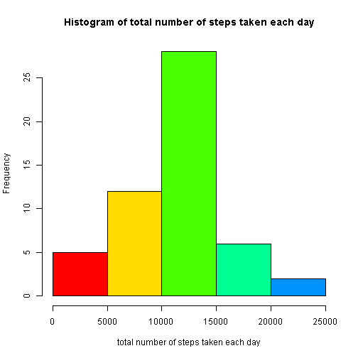
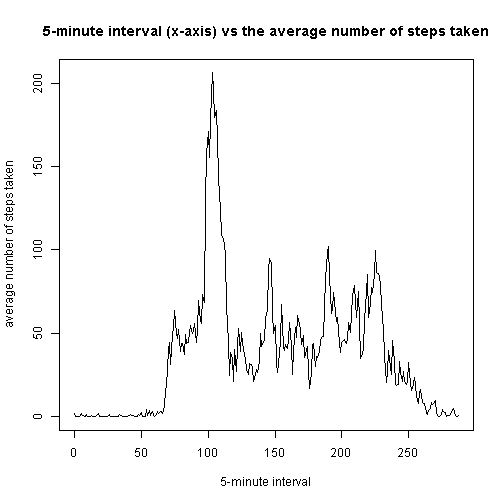
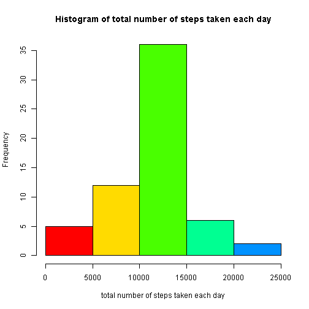
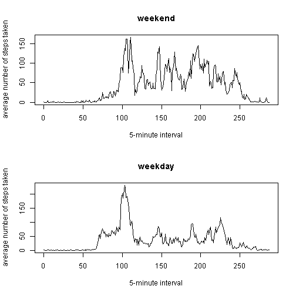

Peer Assignment 1
================================================================================
### Loading and preprocessing the data ###


```r
temp <- tempfile()
download.file("http://d396qusza40orc.cloudfront.net/repdata/data/activity.zip", 
    temp)
data <- read.csv(unz(temp, "activity.csv"))
unlink(temp)

# Removing NA's from the dataset and storing it in data1
data1 <- data[!is.na(data$steps), ]

# Spliting the data1 by date variable into a list called dataSplit
dataSplit <- split(data1, data1$date)

# creating an empty vector called sum_vector
sum_vector <- c()
```


### What is mean total number of steps taken per day? ###

```r
# Iterating through all the variables in the list obtained from the above
# operation and calculating the sum(mean*length) of the steps per day and
# storing the result in a sum_vector
for (i in seq_along(dataSplit)) {
    sum_vector <- c(sum_vector, mean(dataSplit[[i]]$steps) * length(dataSplit[[i]]$steps))
}

# Removing NA's from the sum_vector
sum_vector_without_NA <- sum_vector[!is.na(sum_vector)]

# Histogram of the total number of steps taken each day
hist(sum_vector_without_NA, main = "Histogram of total number of steps taken each day", 
    xlab = "total number of steps taken each day", col = rainbow(7))
```

 

```r

# Finding the mean and the median of the total number of steps taken per
# day
```


The mean of the total number of steps taken per day is 1.0766 &times; 10<sup>4</sup>
 and the corresponding median is 1.0765 &times; 10<sup>4</sup>


### What is the average daily activity pattern? ###


```r
# initialising an empty vector
indices_with_NA <- c()

# This section of the code removes those dates during which no activity is
# recorded
for (i in seq_along(sum_vector)) {
    if (is.na(sum_vector)[i] == TRUE) {
        indices_with_NA <- c(indices_with_NA, i)
    }
}

# removing those no activity days from our dataSplit list and storing the
# result in a new list.
dataSplit_without_NA <- dataSplit[-indices_with_NA]


# initialising an empty data frame called steps_taken_data_frame
steps_taken_data_frame <- data.frame()


# This section of the code loops through all the elements of the list
# dataSpit_without_NA and rbinds the new data frame with such that each
# row represents the step variable for a particular date.
for (i in seq_along(dataSplit_without_NA)) {
    row <- c()
    for (j in seq_along(dataSplit_without_NA[[i]]$steps)) {
        row <- c(row, dataSplit_without_NA[[i]]$steps[j])
    }
    steps_taken_data_frame <- rbind(steps_taken_data_frame, row)
}

# Finding the colMeans of the steps_taken_data_frame. mean_col is the
# vector which contains the mean no. of steps for all 288 -5 min
# intervals)
mean_col <- colMeans(steps_taken_data_frame)


# creating a time series variable p
no_of_intervals <- length(mean_col)
temp <- no_of_intervals - 1
p <- c(0:temp)
p <- ts(p)

# Making a time series plot (i.e. type = 'l') of the 5-minute interval
# (x-axis) and the average number of steps taken, averaged across all days
# (y-axis)
plot(p, mean_col, main = "5-minute interval (x-axis) vs the average number of steps taken", 
    xlab = "5-minute interval", ylab = "average number of steps taken", type = "l")
```

 

```r

# The 5-minute interval, on average across all the days in the dataset,
# containing the maximum number of steps
```


The 5-minute interval, on average across all the days in the dataset, containing the maximum number of step is 835


### Imputing missing values ###


```r
# Calculating the total number of missing values in the dataset (i.e. the
# total number of rows with NAs)
a <- is.na(data$steps)
count = 0
for (i in seq_along(a)) {
    if (a[i] == TRUE) {
        count = count + 1
    }
}
```


Total number of missing values in the dataset (i.e. the total number of rows with NAs) is 2304


```r
# replacing missing values with the mean for that 5-minute interval in the
# original data

temp <- data[1:no_of_intervals, ]$interval
temp <- as.character(temp)
names(mean_col) <- temp


f <- c(1:nrow(data))

for (i in seq_along(f)) {
    if (is.na(data$steps[i]) == TRUE) {
        interval <- data$interval[i]
        mean_value_of_five_min_interval <- mean_col[as.character(interval)]
        data$steps[i] <- mean_value_of_five_min_interval
    }
}


# repeating the same set of operations as in the first section but this
# time with the new data obtained by inputing the missing values
dataSplit_new <- split(data, data$date)
vector_new <- c()
for (i in seq_along(dataSplit_new)) {
    vector_new <- c(vector_new, mean(dataSplit_new[[i]]$steps) * length(dataSplit_new[[i]]$steps))
}
hist(vector_new, main = "Histogram of total number of steps taken each day", 
    xlab = "total number of steps taken each day", col = rainbow(7))
```

 


NEW mean and median total number of steps taken per day are 1.0766 &times; 10<sup>4</sup> and 1.0766 &times; 10<sup>4</sup> respectively


### Are there differences in activity patterns between weekdays and weekends? ###


```r
# this section of the code deals with the creation of new factor variable
# 'weekday' and 'weekend'

new_data <- data
f <- c(1:nrow(new_data))
new_col <- c()
for (i in seq_along(f)) {
    if ((weekdays(as.Date(new_data$date[i])) == "Saturday") | (weekdays(as.Date(new_data$date[i])) == 
        "Sunday")) {
        new_col <- c(new_col, "weekend")
    } else {
        new_col <- c(new_col, "weekday")
    }
}

# adding the new factor variable to the our data frame
data <- cbind(data, new_col)


new_dataSplit <- split(data, data$date)

new_steps_taken_data_frame1 <- data.frame()
new_steps_taken_data_frame2 <- data.frame()

for (i in seq_along(new_dataSplit)) {
    row1 <- c()
    row2 <- c()
    for (j in seq_along(new_dataSplit[[i]]$steps)) {
        if (new_dataSplit[[i]]$new_col[j] == "weekday") {
            row1 <- c(row1, new_dataSplit[[i]]$steps[j])
        } else {
            row2 <- c(row2, new_dataSplit[[i]]$steps[j])
        }
    }
    new_steps_taken_data_frame1 <- rbind(new_steps_taken_data_frame1, row1)
    new_steps_taken_data_frame2 <- rbind(new_steps_taken_data_frame2, row2)
}

# Finding the colMeans of the steps_taken_data_frame. mean_col1 and
# mean_col2 are vectors which contain the mean no. of steps for all 288 -5
# min intervals) for weekday and weekend respectively
mean_col1 <- colMeans(new_steps_taken_data_frame1)
mean_col2 <- colMeans(new_steps_taken_data_frame2)

# creating a time series variable p
no_of_intervals <- length(mean_col1)
temp <- no_of_intervals - 1
p <- c(0:temp)
p <- ts(p)

# Making a time series plot (i.e. type = 'l') of the 5-minute interval
# (x-axis) and the average number of steps taken, averaged across all days
# (y-axis)
par(mfrow = c(2, 1))
plot(p, mean_col2, main = "weekend", xlab = "5-minute interval", ylab = "average number of steps taken", 
    type = "l")
plot(p, mean_col1, main = "weekday", xlab = "5-minute interval", ylab = "average number of steps taken", 
    type = "l")
```

 


### The activity pattern during weekday seems to take peak during certain intervals while the activity pattern during weekend appears to be fairly consistent ###


